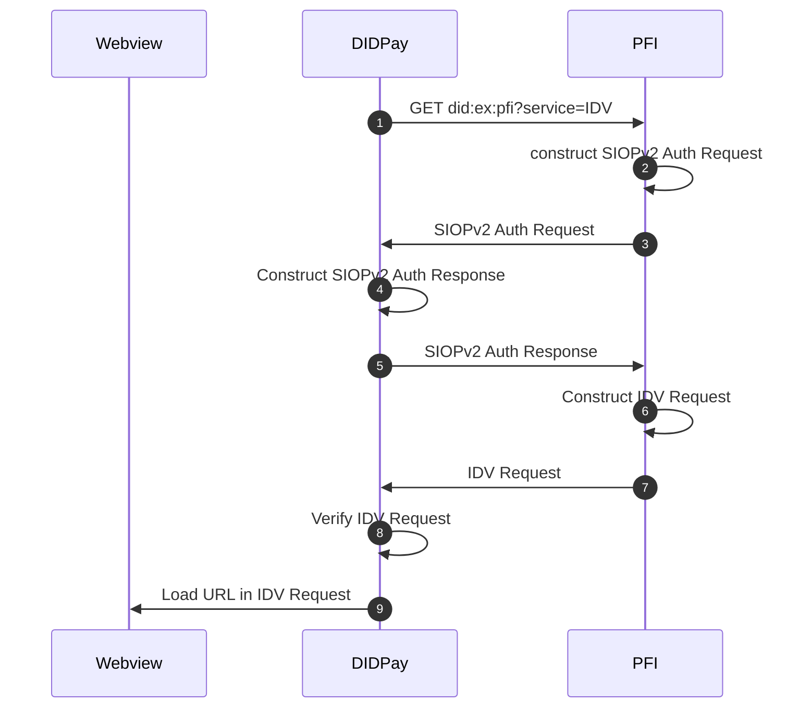
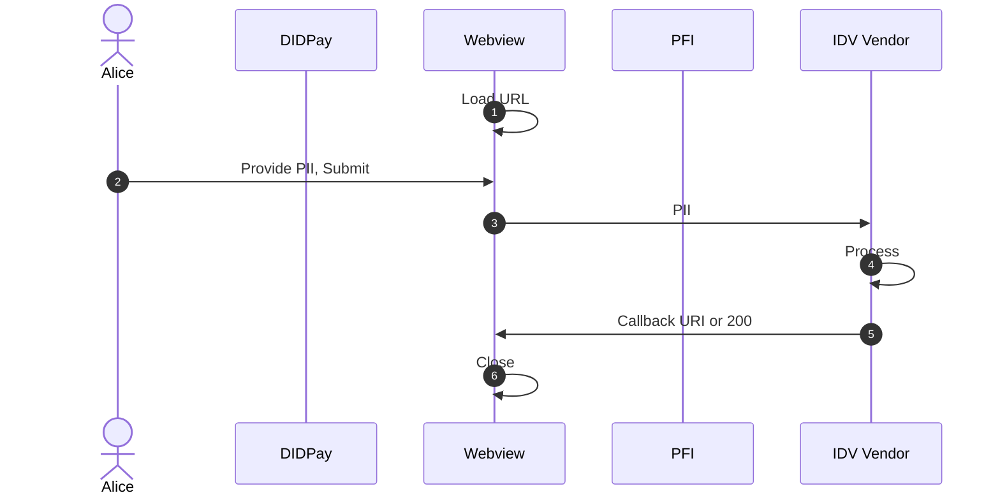
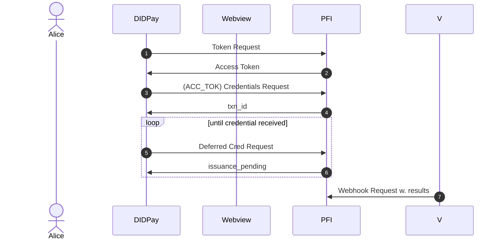

# Known Customer Credential Issuance <!-- omit in toc -->

# Table of Contents <!-- omit in toc -->
- [Introduction](#introduction)
  - [KYC Background](#kyc-background)
    - [Identity Verification](#identity-verification)
    - [IDV Vendor Integrations](#idv-vendor-integrations)
      - [PII Collected by Vendor](#pii-collected-by-vendor)
      - [PII Collected by PFI](#pii-collected-by-pfi)
- [Requirements](#requirements)
- [Implementation Details](#implementation-details)
  - [Context](#context)
  - [Assumptions](#assumptions)
  - [Participants](#participants)
    - [Mobile App](#mobile-app)
    - [Web View](#web-view)
  - [Initiating IDV Flow](#initiating-idv-flow)
  - [IDV](#idv)
    - [Vendor Collects PII](#vendor-collects-pii)
  - [Credential Issuance](#credential-issuance)
- [Other Considerations](#other-considerations)

# Introduction
This document proposes a standardized means for PFIs (Participating Financial Institution) to perform KYC (Know Your Customer) on a DID (Decentralized Identifer) controlled by a retail customer for the purpose of providing financial services to that DID in accordance to regulatory requirements.

## KYC Background
In the financial industry, KYC (Know Your Customer) is a process performed by financial institutions to collect and verify the personal information of individuals with whom they intend to establish customer relationships for the purposes of providing financial services. Performing KYC is essential to comply with regulatory requirements, ensuring that financial institutions adhere to legal standards and prevent fraud, money laundering, and other illicit activities.

Regulatory requirements can vary by region specifically with respect to the information that needs to be collected, how long that information needs to be retained, and how often various aspects of performing KYC need to be repeated and within a given duration (e.g. sanctions screening, re-collecting PII). 

### Identity Verification
IDV (Identity Verification) is a critical part of performing KYC wherein the PII (Personally Identifying Information) collected from an individual is verified using third party resources. IDV often includes steps such as document verification and liveness checks. 

Financial Institutions often leverage IDV Vendors to streamline the IDV process. Integration with IDV vendors happens in 1 of 3 ways:

### IDV Vendor Integrations

#### PII Collected by Vendor
> [!WARNING]
> Include Sequence Diagram where Vendor provides their own onboarding URLs

> [!WARNING]
> Include Sequence Diagram where vendor provides an SDK that takes control of UI

#### PII Collected by PFI

> [!WARNING]
> Inclue Sequence Diagram where PII is collected by financial institution and sent to IDV vendor via backend system

# Requirements
This body of work is an extension of the work being done for tbDEX. In effect, this proposal considers the following as requirements:

1. **Must support all IDV flows described in the [IDV Flows](#identity-verification) section of this document**

Ensuring that this is possible is essential to reduce friction or pain points for financial institutions interested in providing liquidity on tbDEX

---

2. **Must support the ability to provide other Verifiable Credentials or Verifiable Claims as input for IDV (e.g. mDL, eIDAS, VCs from other issuers)**

This requirement is critical to the value proposition of using Verifiable Credentials within the context of KYC. Performing KYC has a non-negligible cost for financial institutions which can be drastically reduced by receiving the necessary PII in a format that has been provably verified by a trusted third party.

> [!IMPORTANT]
> A significantly hairy but equally critical aspect to consider here is scenarios wherein an individual possesses one or more "Identity Wallet" mobile applications where credentials are stored 

> [!IMPORTANT]
> another hairy but critical aspect to consider are flows where a mobile application that is _not_ an identity wallet initiates the IDV process with a PFI

---

3. **Must ensure that applications initiating KCC issuance / IDV flows for PFIs **do not** have to store, handle, relay PII through the initating application's backend systems**

---

4. **Must support scenarios wherein an individual that already has an account with the PFI (created out of band) does not have to go through IDV again**

---

1. **Must make use of pre-existing standards wherever possible.**

There's no point in re-inventing the wheel where it's not necessary. Re-using well established pre-existing standards increases the likelihood of reducing friction for Issuers and Holders

# Implementation Details

Concretely, the objective is to implement a solution that allows a mobile application to initiate an IDV flow with a PFI used to perform KYC that results in a Known Customer Credential issued by the PFI. This KCC can be presented by the holder to the PFI to utilize financial services (e.g. tbDEX value exchange)

## Context
As a means to provide clarity, many of the examples in this section will refer to an imaginary mobile application named DIDPay.

DIDPay is a mobile applicaton that can be used by individuals to:
* Purchase Stablecoin using fiat currency from a PFI via tbDEX. The PFI acts as the custodian of the purchased Stablecoin
* Send custodied Stablecoin to anyone via tbDEX
* Sell Stablecoin for fiat currency through a PFI via tbDEX.

DIDPay acts as a **self-custodial** Identity Wallet that:
* creates a DID for each individual and securely stores private keys directly on device. 
* stores Verifiable Credentials issued to the user directly on device

## Assumptions
* The PFI controls a DID whose method supports `service` endpoints
* The Holder controls their own DID
* The Holder has already discovered the PFI's DID

## Participants

This implementation involves 3 distinct participants that have different responsibilities:

### Mobile App

> [!NOTE]
> AKA DIDPay

The Mobile app is responsible for:
* Initiating the IDV flow of a PFI
* Acquiring Credential offered by PFI

### Web View

> [!NOTE]
> Triggered by the mobile app as a byproduct of initiating the IDV flow 

The Web view is utilized to:
* Render IDV flow of a PFI
* Return an [OID4VCI Credential Offer](https://openid.github.io/OpenID4VCI/openid-4-verifiable-credential-issuance-wg-draft.html#name-credential-offer) back to Mobile App which is then used to acquire a credential

> [!IMPORTANT]
> This implementation has chosen to use Web Views to render IDV flows for the following reasons:
> * provides PFI with maximal flexibility as to _how_ they collect Personal Information from an individual
> * prevents Wallets / Mobile Apps from having to update source code in order to integrate with different PFIs
> * establish a clear distinction between the application initiating the flow and a PFI

## Initiating IDV Flow

Initiating the IDV flow is done using [SIOPv2].

1. Mobile App resolves the PFI's DID and sends an HTTP GET Request to the `serviceEndpoint` of the first `IDV` service found in the resolved DID Document

---

2/3. PFI constructs and returns SIOPv2 Auth Request containing the following

**Auth Request**
| field                     | description                                        | required (y/n) | references                                                                                                                                                                                   | comments                |
| :------------------------ | :------------------------------------------------- | :------------- | :------------------------------------------------------------------------------------------------------------------------------------------------------------------------------------------- | :---------------------- |
| `scope`                   |                                                    |                |                                                                                                                                                                                              |                         |
| `response_type`           |                                                    |                |                                                                                                                                                                                              | MUST include `id_token` |
| `response_uri`            |                                                    | y              | [OID4VP](https://openid.net/specs/openid-4-verifiable-presentations-1_0.html#section-6.2-7.2)                                                                                                |                         |
| `response_mode`           | MUST be `direct_post`                              | y              | [OID4VP](https://openid.net/specs/openid-4-verifiable-presentations-1_0.html#section-6.2-1)                                                                                                  |                         |
| `presentation_definition` | used by PFI to request VCs as input to IDV process | n              | [OID4VP](https://openid.net/specs/openid-4-verifiable-presentations-1_0.html#name-presentation_definition-par)                                                                               |                         |
| `nonce`                   |                                                    |                |                                                                                                                                                                                              |                         |
| `client_metadata`         |                                                    |                | [OIDC](https://openid.net/specs/openid-connect-registration-1_0.html) [SIOPv2](https://openid.github.io/SIOPv2/openid-connect-self-issued-v2-wg-draft.html#name-relying-party-client-metada) |                         |

**Client Metadata**
| field                            | description | required | references                                                                                              | commments |
| :------------------------------- | :---------- | :------- | :------------------------------------------------------------------------------------------------------ | :-------- |
| `subject_syntax_types_supported` |             |          | [SIOPv2](https://openid.github.io/SIOPv2/openid-connect-self-issued-v2-wg-draft.html#section-7.5-2.1.1) |           |
|                                  |             |          |                                                                                                         |           |

References:
* [SIOPv2 Authorization Request](https://openid.github.io/SIOPv2/openid-connect-self-issued-v2-wg-draft.html#name-self-issued-openid-provider-a)
* [OIDC Auth Request](https://openid.net/specs/openid-connect-core-1_0.html#AuthRequest)

---

1. Wallet verifies integrity of Auth Request and constructs an Auth Response

> [!WARNING]
> TODO: Include types for Auth Response

> [!WARNING]
> TODO: Include details on how to construct ID token

---

4. Wallet Sends Auth Response to `redirect_uri` provided in Auth Request

---

5/6. PFI verifies integrity of AuthResponse and constructs IDV Request

> [!WARNING] I don't know if we're breaking OIDC conformance here by using the response returned by RP to convey use-case specific information

**IDV Request**
| field | description | required (y/n) | references | comments |
| :---- | :---------- | :------------- | :--------- | :------- |

---

7. Wallet verifies integrity of IDV Request

---

8. Wallet loads URL provided in IDV Request in Webview 

## IDV

### Vendor Collects PII

## Credential Issuance

# Other Considerations

It may very well be the case that this approach works for identity verification in general even outside the purposes of performing KYC but it's far too early to say or have that discussion. Just something to keep in the back of our minds

---