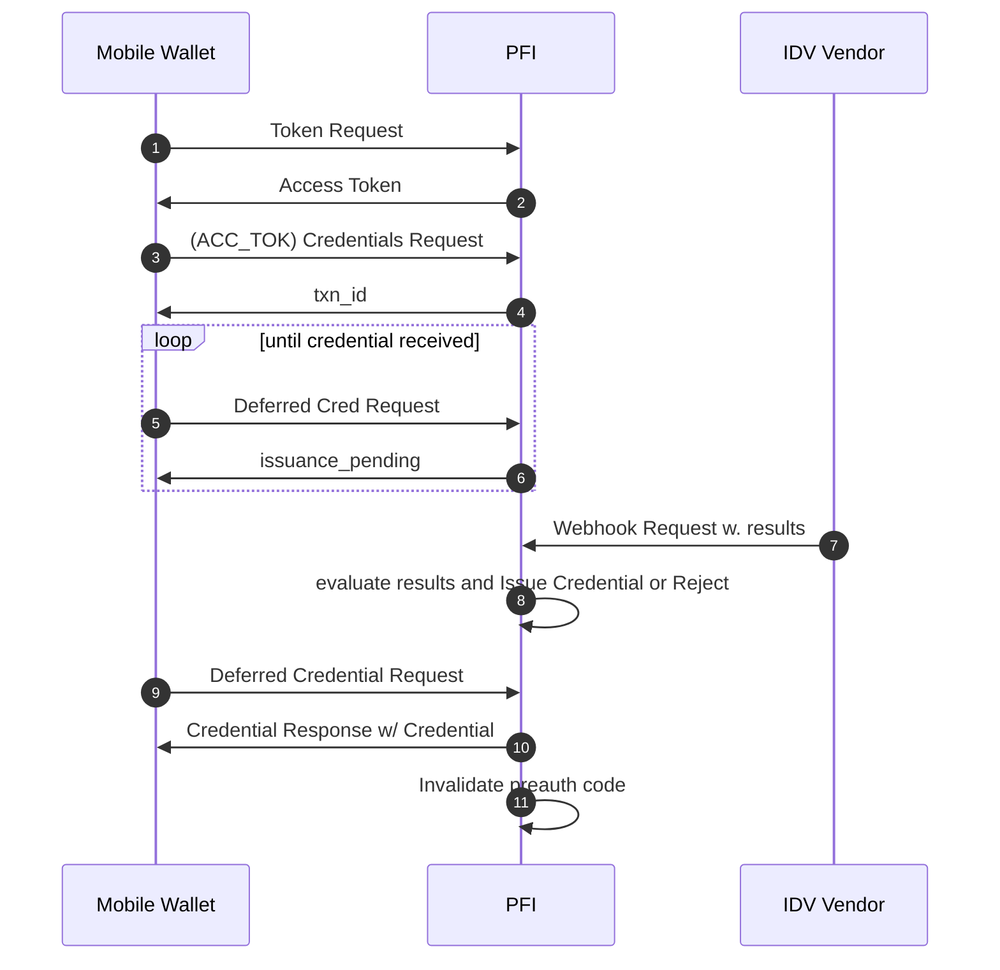

# Known Customer Credential Issuance <!-- omit in toc -->

<!-- TOC -->
- [Introduction](#introduction)
  - [Know Your Customer Background](#know-your-customer-background)
    - [Identity Verification](#identity-verification)
    - [IDV Vendor Integrations](#idv-vendor-integrations)
      - [PII Collected by IDV Vendor](#pii-collected-by-idv-vendor)
      - [PII Collected by PFI](#pii-collected-by-pfi)
- [Requirements](#requirements)
- [Implementation Details](#implementation-details)
  - [Context](#context)
  - [Assumptions](#assumptions)
  - [Participants](#participants)
    - [Mobile App](#mobile-app)
    - [Web View](#web-view)
  - [Initiating IDV Flow](#initiating-idv-flow)
    - [SIOPv2 Authorization Request](#siopv2-authorization-request)
      - [Client Metadata](#client-metadata)
      - [URI Encoding](#uri-encoding)
    - [SIOPv2 Authorization Response](#siopv2-authorization-response)
      - [ID Token](#id-token)
    - [IDV Request](#idv-request)
      - [Credential Offer](#credential-offer)
      - [Grants](#grants)
      - [Grant Type: urn:ietf:params:oauth:grant-type:pre-authorized\_code](#grant-type-urnietfparamsoauthgrant-typepre-authorized_code)
  - [IDV](#idv)
    - [IDV Vendor Collects PII](#idv-vendor-collects-pii)
    - [PFI collects PII](#pfi-collects-pii)
  - [Credential Issuance](#credential-issuance)
- [Other Considerations](#other-considerations)
<!-- TOC -->

# Introduction
This document proposes a standardized means for PFIs (Participating Financial Institutions) to perform IDV (Identity Verification) on a DID (Decentralized Identifier) controlled by a retail customer for the purpose of providing financial services to that DID in accordance to regulatory Know Your Customer requirements.

## Know Your Customer Background
In the financial industry, KYC (Know Your Customer) is term used to describe a set of policies, procedures, and processes that financial institutions use to determine the true identity of a customer, and assess the on-going risk that a customer poses to an organization during the life-time of a customer relationship. KYC typically encompasses:
* Customer identification and verification (IDV);
* Understanding the nature and purpose of customer relationships to develop a customer risk profile; and
* Ongoing monitoring for reporting suspicious transactions and, using a risk-based approach, maintaining and updating customer information. 

Regulatory KYC requirements can vary by region with respect to the information that needs to be collected, the information that needs to be validated and verified, how long that information needs to be retained, and how often various aspects of KYC need to be repeated (e.g. sanctions screening, refreshing IDV, re-collecting source of funds information). 

### Identity Verification
IDV (Identity Verification) is a critical component of KYC wherein the PII (Personally Identifying Information) collected from an individual is verified using third party resources. IDV often includes steps such as verification of a valid government-issued photo ID, liveness checks, and verification of user-submitted PII against authoritative databases.

Financial institutions often leverage IDV Vendors to streamline the IDV process.

### IDV Vendor Integrations

Integration with IDV vendors happens in 1 of 2 ways:

#### PII Collected by IDV Vendor
* IDV Vendor provides an SDK that takes control of the user interface for PII collection. 
* PII is submitted directly to the vendor's backend system 
* IDV Vendor notifies financial institution via webhooks requests when IDV is complete
* Financial institution requests IDV result and PII from IDV Vendor 

#### PII Collected by PFI
* PII is collected by the financial institution
* PII is subsequently sent to the IDV Vendor via the backend system for verification

> [!IMPORTANT]
> Web-based IDV is necessary for reasons that are explained in this document

# Requirements
This body of work is an extension of the work being done for tbDEX. In effect, this proposal considers the following as requirements:

1. **Must support all IDV flows described in the [IDV Vendor Integrations](#idv-vendor-integrations) section of this document**

Ensuring that this is possible is essential to reduce friction or pain points for financial institutions interested in providing liquidity on tbDEX

---

2. **Must support the ability to provide other Verifiable Credentials or Verifiable Claims as input for IDV (e.g. mDL, eIDAS, VCs from other issuers)**

This requirement is critical to the value proposition of using Verifiable Credentials within the context of KYC. Performing KYC has a non-negligible cost for financial institutions which can be drastically reduced by receiving the necessary PII in a format that has been provably verified by a trusted third party.

> [!IMPORTANT]
> We will need to consider scenarios wherein an individual possesses one or more "Identity Wallet" mobile applications that store credentials 

> [!IMPORTANT]
> We will need to consider issuance _to_ and presentation _from_ identity wallets that did not initiate the flow

---

3. **Must ensure that applications initiating KCC issuance / IDV flows for PFIs **do not** have to store, handle, or relay PII through the initating application's backend systems**

Necessitating that PII come in contact with an application's backend systems introduces undesired complexity for many use-cases (e.g. self-custodial wallets that wish to provide on/off-ramps to their users without owning customer relationships)

---

4. **Must prevent individuals who already have a pre-existing account with a PFI from having to go through IDV again**

A PFI could be a bank that an individual already has an account with. In this scenario, The individual should be able to _log in_ to their pre-existing account via webview vs. having to go through IDV again. 

---

5. **Must make use of pre-existing standards wherever possible.**

Interoperability is critical for the ecosystem as a whole. This is also an implied requirement  in order to leverage credentials that are already being issued/presented using pre-existing standards 

---

# Implementation Details

Concretely, the objective is to implement a solution that allows a mobile application to initiate an IDV flow with a PFI used to perform KYC that results in a Known Customer Credential issued by the PFI. This KCC can be presented by the holder to the PFI to utilize financial services (e.g. tbDEX value exchange)

## Context
As a means to provide clarity, many of the examples in this section will refer to an imaginary mobile application named Mobile Wallet.

Mobile Wallet is a mobile application that can be used by individuals to:
* Purchase Stablecoin using fiat currency from a PFI via tbDEX. The PFI acts as the custodian of the purchased Stablecoin
* Send custodied Stablecoin to anyone via tbDEX
* Sell Stablecoin for fiat currency through a PFI via tbDEX.

Mobile Wallet acts as a **self-custodial** Identity Wallet that:
* creates a DID for each individual and securely stores private keys directly on device. 
* stores Verifiable Credentials issued to the user directly on device

## Assumptions
* The PFI controls a DID whose method supports `service` endpoints
* The Holder controls their own DID
* The Holder has already discovered the PFI's DID

## Participants

This implementation involves 3 distinct participants that have different responsibilities:

### Mobile App

The Mobile app is responsible for:
* Initiating the IDV flow of a PFI
* Acquiring Credential offered by PFI

### Web View

> [!NOTE]
> Triggered by the mobile app as a byproduct of initiating the IDV flow 

The Web view is utilized to:
* Render IDV flow of a PFI
* Return an [OID4VCI Credential Offer](https://openid.github.io/OpenID4VCI/openid-4-verifiable-credential-issuance-wg-draft.html#name-credential-offer) back to Mobile App which is then used to acquire a credential

> [!IMPORTANT]
> This implementation has chosen to use Web Views to render IDV flows for the following reasons:
> * provides PFI with maximal flexibility as to _how_ they collect Personal Information from an individual
> * prevents Wallets / Mobile Apps from having to update source code in order to integrate with different PFIs
> * establish a clear distinction between the application initiating the flow and a PFI

## Initiating IDV Flow

Initiating the IDV flow is done using [SIOPv2](https://openid.github.io/SIOPv2/openid-connect-self-issued-v2-wg-draft.html).

1. Mobile App resolves the PFI's DID and sends an HTTP GET Request to the `serviceEndpoint` of the first `IDV` service found in the resolved DID Document
2. PFI constructs a [SIOPv2 Authorization Request](#siopv2-authorization-request)
3. PFI URI encodes SIOPv2 Authorization Request and returns in HTTP response
4. Wallet verifies integrity of SIOPv2 Authorization Request and constructs a [SIOPv2 Authorization Response](#siopv2-authorization-response)
5. Wallet POSTs SIOPv2 Authorization Response to the `response_uri` from the SIOPv2 Authorization Request 
6. PFI verifies integrity of SIOPv2 Authorization Response and constructs IDV Request
7. PFI returns IDV Request in HTTP response
8. Wallet verifies integrity of IDV Request
9. Wallet loads URL provided in IDV Request in Webview

> [!WARNING]
> I don't know if we're breaking OIDC conformance here by using the response returned by RP to convey use-case specific information

### SIOPv2 Authorization Request

| Field                     | Description                                                                                  | Required | References                                                                                                                                                                                   | Comments                                                  |
| :------------------------ | :----------------------------------------------------------------------------------------- | :------- | :------------------------------------------------------------------------------------------------------------------------------------------------------------------------------------------- | :-------------------------------------------------------- |
| `client_id`               | The DID of the RP, which is us (the PFI)                                                     | y        |                                                                                                                                                                                              |                                                           |
| `scope`                   | What's being requested. 'openid' indicates ID Token is being requested                       | y        | [OIDC](https://openid.net/specs/openid-connect-core-1_0.html#AuthRequest)                                                                                                                    |                                                           |
| `response_type`           | What sort of response the RP is expecting. MUST include `id_token`. MAY include `vp_token`   | y        | [OIDC](https://openid.net/specs/openid-connect-core-1_0.html#Authentication)                                                                                                                 |                                                           |
| `response_uri`            | The URI to which the SIOPv2 Authorization Response will be sent                              | y        | [OID4VP](https://openid.net/specs/openid-4-verifiable-presentations-1_0.html#section-6.2-7.2)                                                                                                |                                                           |
| `response_mode`           | The mode in which the SIOPv2 Authorization Response will be sent. MUST be `direct_post`      | y        | [OID4VP](https://openid.net/specs/openid-4-verifiable-presentations-1_0.html#section-6.2-1)                                                                                                  |                                                           |
| `presentation_definition` | Used by PFI to request VCs as input to IDV process                                           | n        | [OID4VP](https://openid.net/specs/openid-4-verifiable-presentations-1_0.html#name-presentation_definition-par)                                                                               | If present, Response Type `vp_token` MUST also be present |
| `nonce`                   | A nonce which MUST be included in the ID Token provided in the SIOPv2 Authorization Response | y        |                                                                                                                                                                                              |                                                           |
| `client_metadata`         | A JSON object containing the Verifier metadata values                                        | y        | [OIDC](https://openid.net/specs/openid-connect-registration-1_0.html) [SIOPv2](https://openid.github.io/SIOPv2/openid-connect-self-issued-v2-wg-draft.html#name-relying-party-client-metada) |                                                           |

#### Client Metadata
| Field                            | Description                                                                                                 | Required | References                                                                                              | Comments                  |
| :------------------------------- | :---------------------------------------------------------------------------------------------------------- | :------- | :------------------------------------------------------------------------------------------------------ | :------------------------ |
| `subject_syntax_types_supported` | Space separated list of DID methods supported for the subject of ID Token                                   | y        | [SIOPv2](https://openid.github.io/SIOPv2/openid-connect-self-issued-v2-wg-draft.html#section-7.5-2.1.1) | Example `did:dht did:jwk` |
| `client_name`                    | Human-readable string name of the client to be presented to the end-user during authorization               | n        | [RFC7591](https://www.rfc-editor.org/rfc/rfc7591.html#section-2)                                        |                           |
| `client_uri`                     | URI of a web page providing information about the client                                                    | n        | [RFC7591](https://www.rfc-editor.org/rfc/rfc7591.html#section-2)                                        |                           |
| `logo_uri`                       | URI of an image logo for the client                                                                         | n        | [RFC7591](https://www.rfc-editor.org/rfc/rfc7591.html#section-2)                                        |                           |
| `contacts`                       | Array of strings representing ways to contact people responsible for this client, typically email addresses | n        | [RFC7591](https://www.rfc-editor.org/rfc/rfc7591.html#section-2)                                        |                           |
| `tos_uri`                        | URI that points to a terms of service document for the client                                               | n        | [RFC7591](https://www.rfc-editor.org/rfc/rfc7591.html#section-2)                                        |                           |
| `policy_uri`                     | URI that points to a privacy policy document                                                                | n        | [RFC7591](https://www.rfc-editor.org/rfc/rfc7591.html#section-2)                                        |                           |

> [!IMPORTANT]
> Include `vp_formats` in Client Metadata?  https://openid.net/specs/openid-4-verifiable-presentations-1_0.html#section-9.1-2.2

> [!IMPORTANT]
> the inclusion of `presentation_definition` as per [OID4VP](https://openid.net/specs/openid-4-verifiable-presentations-1_0.html#name-presentation_definition-par) allows for other verifiable credentials to be provided as input for IDV.

#### URI Encoding

The SIOPv2 Authorization Request is encoded as a URI before being returned to Mobile Wallet, as per [SIOPv2](https://openid.github.io/SIOPv2/openid-connect-self-issued-v2-wg-draft.html#section-5). No `authorization_endpoint` is used in the URI, so it is the query parameter portion of the URI only.

### SIOPv2 Authorization Response

| Field                     | Description                                                                                                        | Required | References                                                                                                                                                     | Comments |
| :------------------------ | :----------------------------------------------------------------------------------------------------------------- | :------- | :------------------------------------------------------------------------------------------------------------------------------------------------------------- | :------- |
| `id_token`                | A self issued, signed JWT which responds to the SIOPv2 Authorization Request                                                | y        | [JWT](https://www.rfc-editor.org/info/rfc7519) [SIOPv2](https://openid.github.io/SIOPv2/openid-connect-self-issued-v2-wg-draft.html#name-self-issued-id-token) |          |
| `vp_token`                | A Verifiable Presentation or an array of VPs in response to `presentation_definition`                              | n        | [OIDV4VP](https://openid.net/specs/openid-4-verifiable-presentations-1_0.html#section-6.1-2.2)                                                                 |          |
| `presentation_submission` | A Presentation Submission that contains mappings between the requested VC and where to find them within `vp_token` | n        | [OIDV4VP](https://openid.net/specs/openid-4-verifiable-presentations-1_0.html#section-6.1-2.4)                                                                 |          |

#### ID Token
| Field   | Description                                                                                      | Required | References | Comments |
| :------ | :----------------------------------------------------------------------------------------------- | :------- | :--------- | :------- |
| `iss`   | Issuer MUST match the value of `sub`                                                             | y        |            |          |
| `sub`   | Subject. The DID of the customer applying for KCC                                                | y        |            |          |
| `aud`   | Audience MUST match the value of `client_id` from the SIOPv2 Authorization Request (PFI's DID)   | y        |            |          |
| `nonce` | Nonce MUST match the value of `nonce` from the SIOPv2 Authorization Request                      | y        |            |          |
| `exp`   | Expiry time                                                                                      | y        |            |          |
| `iat`   | Issued at time                                                                                   | y        |            |          |

### IDV Request
| Field              | Description                     | Required | References                                                                                                                            | Comments                                                                                       |
| :----------------- | :------------------------------ | :------- | :------------------------------------------------------------------------------------------------------------------------------------ | :--------------------------------------------------------------------------------------------- |
| `url`              | URL of form used to collect PII | y        |                                                                                                                                       | Required for now until we figure out how to support exclusively providing credentials as input |
| `credential_offer` |                                 | y        | [OID4VCI](https://openid.github.io/OpenID4VCI/openid-4-verifiable-credential-issuance-wg-draft.html#name-credential-offer-parameters) |                                                                                                |

#### Credential Offer
| Field                          | Description                                                                                                                                                         | Required | References                                                                                                             | Comments |
| :----------------------------- | :------------------------------------------------------------------------------------------------------------------------------------------------------------------ | :------- | :--------------------------------------------------------------------------------------------------------------------- | :------- |
| `credential_issuer`            | The URL of the Credential Issuer that the Wallet will interact with in subsequent steps                                                                             | y        | [OID4VCI](https://openid.github.io/OpenID4VCI/openid-4-verifiable-credential-issuance-wg-draft.html#section-4.1.1-2.1) |          |
| `credential_configuration_ids` | Array of unique strings that each identify a credential being offered. Wallet can use these to request metadata                                                     | y        | [OID4VCI](https://openid.github.io/OpenID4VCI/openid-4-verifiable-credential-issuance-wg-draft.html#section-4.1.1-2.2) |          |
| `grants`                       | Object containing Grant Types that the Credential Issuer will accept for this credential offer. MUST contain `urn:ietf:params:oauth:grant-type:pre-authorized_code` | y        | [OID4VCI](https://openid.github.io/OpenID4VCI/openid-4-verifiable-credential-issuance-wg-draft.html#section-4.1.1-2.3) |          |

#### Grants 
| Field                                                  | Description                                                                                      | Required | References                                                                                                               | Comments |
| :----------------------------------------------------- | :----------------------------------------------------------------------------------------------- | :------- | :----------------------------------------------------------------------------------------------------------------------- | :------- |
| `urn:ietf:params:oauth:grant-type:pre-authorized_code` | Grant Type that allows the Wallet to follow a Pre-Authorized Code Flow to collect the credential | y        | [OID4VCI](https://openid.github.io/OpenID4VCI/openid-4-verifiable-credential-issuance-wg-draft.html#section-4.1.1-4.2.1) |          |

#### Grant Type: urn:ietf:params:oauth:grant-type:pre-authorized_code
| Field                 | Description                                                                                       | Required | References                                                                                                                 | Comments |
| :-------------------- | :------------------------------------------------------------------------------------------------ | :------- | :------------------------------------------------------------------------------------------------------------------------- | :------- |
| `pre-authorized_code` | The code representing the Credential Issuer's authorization for the Wallet to obtain a credential | y        | [OID4VCI](https://openid.github.io/OpenID4VCI/openid-4-verifiable-credential-issuance-wg-draft.html#section-4.1.1-4.2.2.1) |          |

> [!WARNING] 
> TODO: explain rationale behind providing `credential_offer` at this stage

## IDV

> [!IMPORTANT]
> Whether the PFI is utilizing an IDV vendor is entirely opaque from the originating mobile app's perspective.

### IDV Vendor Collects PII

### PFI collects PII

## Credential Issuance

# Other Considerations

It may very well be the case that this approach works for identity verification in general even outside the purposes of performing KYC but it's far too early to say or have that discussion. Just something to keep in the back of our minds

---
